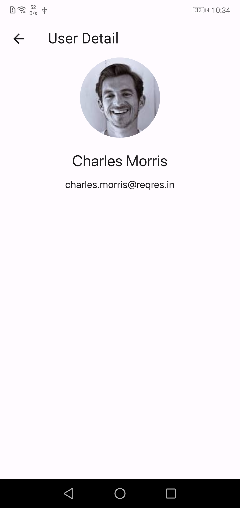
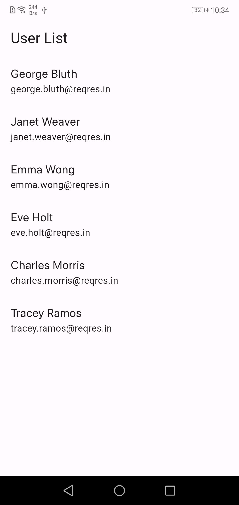

# User List App with Bloc

 A sample Applicayion for Listing users and there details 

## Some screenshots

|                                      |                                      |
| ------------------------------------ | ------------------------------------ |
|  | 
|
  |

---

### :heart: Found this project useful?

If you found this project useful, then please consider giving it a :star: on Github and sharing it with your friends via social media.

## Features

- Display List of Users with smooth animation
- Bloc  clean architecture
- infinite-Scrol using pagenitation
- Open-source

---

## Getting Started

This project is a starting point for a Flutter application.

A few resources to get you started if this is your first Flutter project:

1. Clone the repository
2. Run `flutter pub get` to install dependencies
3. Run the app on an emulator or physical device

The  customized to fit your use-case by modifying the code in the `main.dart` file and other files. The source code  available on GitHub.

- [Lab: Write your first Flutter app](https://flutter.dev/docs/get-started/codelab)
- [Cookbook: Useful Flutter samples](https://flutter.dev/docs/cookbook)
- [API:For testing Base Url](https://reqres.in/)

For help getting started with Flutter, view our
[online documentation](https://flutter.dev/docs), which offers tutorials,
samples, guidance on mobile development, and a full API reference.